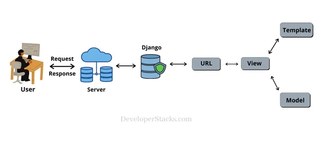
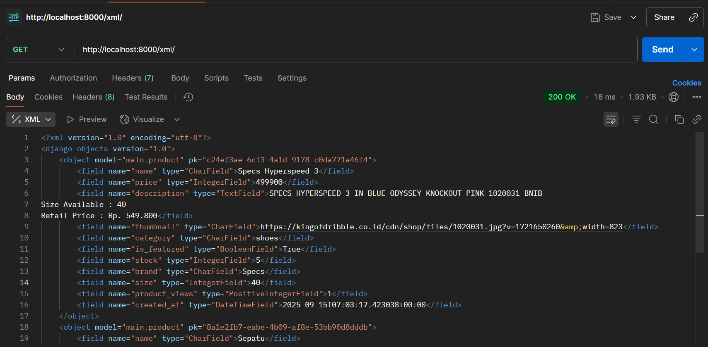
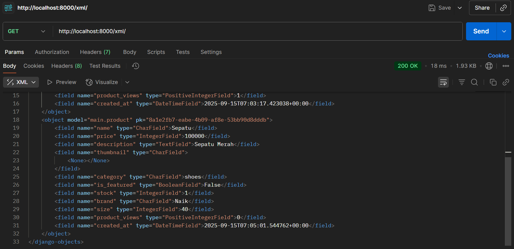
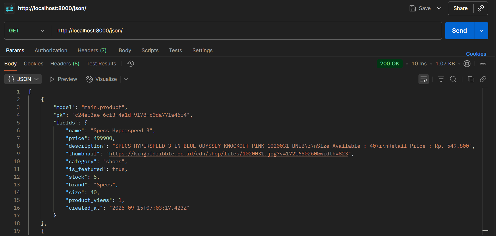
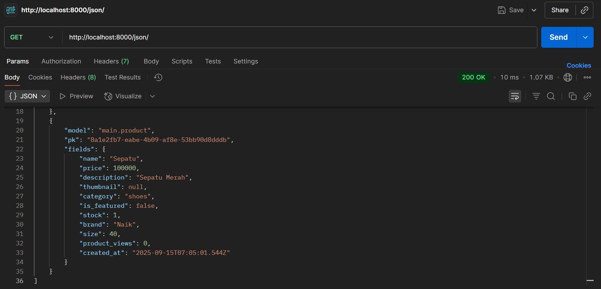
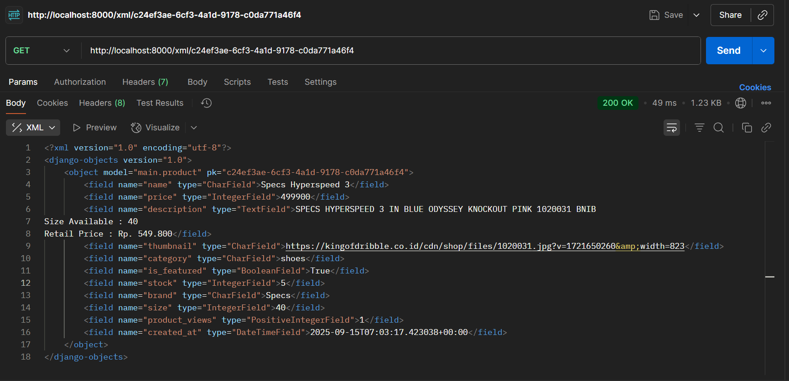
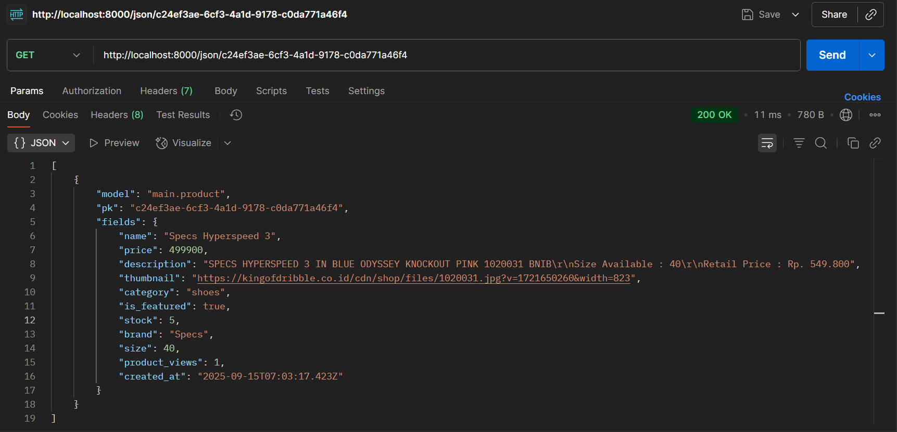

# Kick Corner — Django Web App

Aplikasi web berbasis Django untuk menampilkan daftar produk olahraga.  
Dibuat untuk tugas mata kuliah **PBP**.

**Link Deploy (PWS):** https://keisha-vania-kickcorner.pbp.cs.ui.ac.id/

- **Shop**: Kick Corner  
- **NPM**: 2406437331  
- **Nama**: Keisha Vania Laurent  
- **Kelas**: PBP B  

# Tugas Individu 2

## Implementasi checklist

1. **Membuat proyek dan app**
   - Memulai dengan membuat repo bernama `kick-corner` berisi proyek Django dengan package utama `kick_corner`.
   - Lalu membuat aplikasi `main` dan mendaftarkannya pada `INSTALLED_APPS` di `kick_corner/settings.py` agar dikenali oleh Django.

2. **Menghubungkan routing proyek ke app**
   - Di `kick_corner/urls.py`, saya mengarahlan rute utama (root path) ke `include('main.urls')`.  
   - Ini memastikan setiap request ke root situs diteruskan ke routing milik app `main`, supaya logika halaman utama terpusat di app.

3. **Merancang model `Product`**
   - Model disimpan di `main/models.py` dengan **UUID** sebagai primary key agar id unik. 
   - Atribut yang dibuat:
     - `name`, `price`, `description` untuk informasi dasar produk.
     - `thumbnail` sebagai URL gambar yang bersifat opsional (boleh kosong).
     - `category` memakai **`choices`** (`jersey`, `shoes`, `ball`, `accessory`, `training`, `nutrition`, `merchandise`).
     - `is_featured` sebagai penanda produk unggulan.
     - `stock`, `brand`, dan `size` untuk kebutuhan domain toko olahraga (ketersediaan, merek, ukuran).  
   - `__str__` mengembalikan nama produk agar mudah dibaca di admin/log.
   - Setelah itu, saya membuat dan menerapkan **migrasi** agar skema database sinkron dengan definisi model.

4. **Menyusun fungsi pada `views.py`**
   - Di `main/views.py` saya membuat fungsi show_main yang:
     - Mengambil semua data `Product`.
     - Menyusun context (shop, NPM, nama, kelas, products).
     - Merender ke `main.html` agar data tampil rapi.

5. **Membuat routing app**
   - Di `main/urls.py`, saya memetakan path root ('') ke `show_main`.
   - Dengan begitu, ketika pengunjung membuka halaman utama, langsung diarahkan ke view yang menampilkan identitas dan daftar produk.

6. **Membangun template untuk tampilan**
   - Di `main/templates/main.html`, saya menampilkan:
     - Identitas (shop, NPM, nama, kelas) di header.
     - Daftar produk: gambar (jika ada), nama, label kategori via `{{ p.get_category_display }}`, brand (jika ada), penanda featured, harga, dan deskripsi.
     - Fallback “There is no product yet.” jika database masih kosong.

7. **Deployment ke PWS**
   - Saya mengunggah kode ke PWS sesuai alur platform:
     - Membuat proyek PWS
     - Atur environment variables
     - Menambahkan URL deployment PWS pada `ALLOWED_HOSTS`
     - Commit perubahan dan jalankan project command dari PWS

8. **Membuat README.md**
   - Saya menambahkan tautan PWS dan menjelaskan keseluruhan proses di atas dan juga menjelaskan mengenai alur request/response (kaitan `urls.py` → `views.py` → `models.py` → template), peran `settings.py`, cara kerja migrasi, alasan memilih Django, serta feedback untuk asisten dosen. (Akan ada di bawah ini).

## Bagan arsitektur request/response

Django adalah web framework berbasis Python yang mengikuti pola **Model–View–Template (MVT)**. Pola ini memisahkan antara logika data (model), logika aplikasi (view), dan tampilan (template). Alur request–response di Django dapat dijelaskan sebagai berikut:

1. **Client → Server → Django**  
   User mengirimkan request melalui browser. Request ini diteruskan ke aplikasi Django oleh server.

2. **URL (`urls.py`)**  
   Django memiliki URL dispatcher yang bertugas mencocokkan path request dengan pola yang ada di `urls.py`. Misalnya, permintaan ke `/` diarahkan ke fungsi `show_main` di `views.py`.

3. **View (`views.py`)**  
   View bertugas memproses request.
   - Mengambil data dari model (`models.py`),
   - Menyusun context yang berisi data dan identitas,
   - Memanggil template untuk merender halaman.  

   Di proyek ini, `show_main` mengambil daftar produk dari model `Product` dan meneruskannya ke template `main.html`.

4. **Model (`models.py`)**  
   Model merepresentasikan struktur data di database. Misalnya, `Product` dengan field `name`, `price`, `category`, dll. View menggunakan ORM Django untuk berinteraksi dengan model, misalnya `Product.objects.all()` untuk mengambil semua produk.

5. **Template (`main.html`)**  
   Template merender data menjadi HTML. Context dari view (identitas dan daftar produk) ditampilkan dalam format halaman web.

6. **Response kembali ke Client**  
   Hasil render berupa HTML dikirim kembali ke browser, lalu ditampilkan ke user sebagai halaman web.

### Hubungan antar file

- **`urls.py`** → menghubungkan request dengan fungsi view yang tepat.  
- **`views.py`** → berisi logika aplikasi, mengambil data dari model, lalu menyiapkan context.  
- **`models.py`** → merepresentasikan struktur database, menyimpan dan mengelola data.  
- **Template (HTML)** → menampilkan data ke user dengan format yang diinginkan.  

Dengan arsitektur ini, Django menyederhanakan proses membangun aplikasi web yang kompleks dengan cara yang terstruktur, cepat, dan aman.

Referensi: https://medium.com/@dhanendra73984/understanding-django-architecture-workflow-advantages-and-beginners-setup-guide-ad77f390bcc3

## Peran `settings.py` dalam proyek Django

File `settings.py` berfungsi sebagai pusat konfigurasi proyek Django. Semua pengaturan inti aplikasi didefinisikan di sini, mulai dari keamanan, daftar aplikasi, hingga database dan template. Di proyek ini, `settings.py` mengatur beberapa hal penting:

1. **Keamanan**: `SECRET_KEY` digunakan untuk operasi kriptografi, `DEBUG` menentukan mode development atau production, dan `ALLOWED_HOSTS` membatasi domain yang boleh mengakses aplikasi (termasuk domain PWS).

2. **Aplikasi & Middleware**: `INSTALLED_APPS` mendaftarkan aplikasi yang digunakan (misalnya `main`), sedangkan `MIDDLEWARE` berisi komponen perantara seperti autentikasi, session, dan proteksi CSRF.

3. **Routing & Template**: `ROOT_URLCONF` menunjuk ke `kick_corner/urls.py`, sementara `TEMPLATES` mengatur rendering HTML agar Django bisa menemukan file seperti `main/templates/main.html`.

4. **Database**: Saat development, proyek menggunakan SQLite. Saat production, konfigurasi PostgreSQL digunakan, dengan kredensial diambil dari environment variables (`.env` atau PWS).

5. **Lain-lain**: File ini juga mengatur validasi password, bahasa (`LANGUAGE_CODE`), zona waktu (`TIME_ZONE`), static files (`STATIC_URL`), dan tipe primary key default untuk model.

Singkatnya, `settings.py` adalah **otak konfigurasi** proyek Django. Tanpa file ini, Django tidak tahu harus menggunakan aplikasi apa, database mana, atau bagaimana cara merender template dan mengelola keamanan aplikasi.

## Cara kerja migrasi database di Django

Migrasi database di Django adalah mekanisme untuk menjaga agar struktur database selalu sesuai dengan definisi model pada kode. Prosesnya berjalan dalam beberapa tahap:

1. **Membuat Migrasi**  
   Setiap kali ada perubahan pada `models.py` (misalnya menambah field, mengubah tipe data, atau membuat model baru), Django bisa mendeteksi perubahan ini dan membuat berkas migrasi. Berkas ini berisi instruksi bagaimana database harus diubah.

2. **Menerapkan Migrasi** 
   Saat migrasi dijalankan, Django membaca berkas migrasi tersebut dan mengeksekusi instruksi di database. Contohnya: membuat tabel baru untuk model `Product`, menambah kolom `brand`, atau mengubah properti field tertentu.

3. **Mencatat Status Migrasi**  
   Django menyimpan catatan semua migrasi yang sudah dijalankan di tabel khusus bernama `django_migrations`. Dengan begitu, Django tahu migrasi mana yang sudah diterapkan dan mana yang belum.

Dengan sistem ini, developer bisa mengembangkan aplikasi dengan lebih fleksibel. Struktur database dapat terus berkembang mengikuti perubahan kode, tanpa perlu menulis query SQL manual. Migrasi juga memastikan semua developer memiliki struktur database yang konsisten.

## Mengapa Django cocok jadi framework awal untuk belajar?

Menurut saya, Django dipilih sebagai framework awal dalam pembelajaran karena sifatnya yang serba lengkap dan terstruktur. Framework ini sudah menyediakan banyak fitur bawaan seperti autentikasi, ORM untuk interaksi dengan database, serta proteksi keamanan, sehingga mahasiswa tidak perlu menambahkan komponen tambahan untuk memulai. 

Selain itu, Django menerapkan pola Model–View–Template (MVT) yang membantu memahami pemisahan antara data, logika, dan tampilan secara jelas. Hal ini sangat bermanfaat untuk melatih pola pikir terstruktur dalam membangun aplikasi. 

Dokumentasi yang lengkap, komunitas yang besar, serta penggunaannya yang luas di industri juga menjadi alasan mengapa Django relevan untuk dipelajari sejak awal. Django dapat memberikan pengalaman belajar yang mudah diikuti pemula dan tetap memberikan gambaran nyata tentang bagaimana aplikasi skala besar dikembangkan.

## Apakah ada feedback untuk asisten dosen tutorial 1?

Tidak ada.

# Tugas Individu 3

## Mengapa perlu data delivery dalam pengimplementasian sebuah platform? 

1. **Mengirimkan data ke pengguna**
   Tanpa data delivery, data hanya akan tersimpan di server dan tidak pernah sampai ke pengguna. Platform tidak akan berguna kalau pengguna tidak bisa melihat atau memakai data di dalamnya.

2. **Fitur real-time dan pengalaman pengguna**
   Data delivery memastikan pengguna selalu mendapat data versi terbaru secara real-time atau hampir real-time.

3. **Analitik dan pengambilan keputusan**
   Data mentah dari aktivitas pengguna (klik, waktu yang dihabiskan, riwayat pembelian) sangat berguna untuk menganalisis perilaku pengguna dan tren bisnis. Dengan data delivery, keputusan akan dibuat berdasarkan data nyata. 

## Mana yang lebih baik antara XML dan JSON? Mengapa JSON lebih populer dibandingkan XML?

Menurut saya, **JSON lebih baik dibandingkan XML**, tetapi JSON dan XML sebenarnya memiliki beberapa kesamaan mendasar. Keduanya bersifat self-describing, artinya struktur datanya bisa dibaca dan dipahami manusia tanpa alat khusus. Baik JSON maupun XML juga bersifat hierarkis, data dapat berisi data lain di dalamnya (*nested*). Selain itu, keduanya dapat diproses oleh banyak bahasa pemrograman.

Namun, ada perbedaan penting yang membuat JSON lebih disukai. JSON tidak menggunakan tag pembuka dan penutup seperti XML sehingga ukuran datanya lebih ringkas dan mudah dibaca. JSON juga mendukung array secara langsung, sedangkan XML perlu struktur tambahan untuk merepresentasikannya. Yang paling signifikan, XML harus diurai menggunakan parser XML khusus, sedangkan JSON cukup diurai dengan fungsi bawaan JavaScript (`JSON.parse`) sehingga prosesnya jauh lebih cepat dan sederhana.

Karena itu, JSON dianggap lebih unggul. Dengan XML, kita harus mengambil dokumen XML, kemudian memprosesnya dengan XML DOM, menelusuri setiap elemen, lalu mengekstrak nilai dan menyimpannya dalam variabel. Sementara dengan JSON, kita cukup mengambil string JSON dan langsung mengubahnya menjadi objek siap pakai hanya dengan satu langkah parsing. Kesederhanaan inilah yang membuat JSON lebih cepat, ringan, dan praktis digunakan dibandingkan XML.

## Apa fungsi dari method `is_valid()` pada form Django dan mengapa itu dibutuhkan?

### **Fungsi `is_valid()`**
- Mengecek apakah semua field yang wajib diisi sudah terisi
- Mengecek apakah format data sesuai (misalnya email valid, angka benar, panjang teks sesuai batas)
- Menjalankan semua custom validation yang kita buat di form
- Jika semua validasi lolos, is_valid() akan mengembalikan True. Jika ada kesalahan, akan mengembalikan False dan kita bisa melihat daftar error lewat `form.errors`.

### **Kenapa dibutuhkan?**

`is_valid()` dibutuhkan karena method ini memastikan bahwa data yang dikirim pengguna ke form benar dan sesuai aturan sebelum diproses lebih lanjut oleh Django. Tanpa validasi ini, data yang salah atau tidak lengkap bisa masuk ke sistem dan menyebabkan error saat disimpan ke database atau saat digunakan dalam logika program. Dengan memanggil `is_valid()`, Django akan mengecek setiap field di form sesuai tipe data dan aturan validasinya, lalu memberi tahu apakah datanya aman untuk dipakai. Hal ini penting agar integritas data tetap terjaga dan pengguna bisa mendapat umpan balik jika ada kesalahan input.

## Mengapa dibutuhkan `csrf_token` saat membuat form di Django? Apa yang terjadi jika tidak menambahkan `csrf_token`? Bagaimana hal tsb dapat dimanfaatkan oleh penyerang?

### **Mengapa `csrf_token` dibutuhkan?**

`csrf_token` dalah kode unik yang dibuat oleh server dan disisipkan ke setiap form. Saat form dikirim, Django akan memeriksa apakah token yang dikirim cocok dengan token yang tersimpan di sesi pengguna. Jika cocok, permintaan dianggap sah, jika tidak, permintaan akan ditolak.

Ini penting karena memastikan bahwa form benar-benar dikirim oleh pengguna yang sah dari situs kita sendiri, bukan dari situs pihak ketiga yang bisa saja dibuat oleh orang lain.

### **Apa yang terjadi jika tidak ada `csrf_token`?**

Kalau kita tidak menambahkan `csrf_token`, maka form tidak memiliki mekanisme verifikasi asal permintaan. Akibatnya, server tidak bisa membedakan apakah permintaan tersebut dikirim langsung oleh pengguna dari situs kita atau dikirim dari situs lain.

### **Bagaimana penyerang dapat memanfaatkannya?**

Tanpa `csrf_token`, penyerang bisa membuat halaman web palsu yang diam-diam mengirim form ke server kita atas nama korban yang sedang login (karena browser korban otomatis mengirimkan cookie sesi).

Misalnya, jika pengguna sedang login ke situs bank, penyerang dapat membuat halaman berbahaya yang mengirimkan form transfer uang ke server bank tanpa sepengetahuan pengguna. Karena tidak ada `csrf_token`, server akan menganggap permintaan itu sah dan memprosesnya.

## Implementasi checklist

1. **Menambahkan 4 + 2 fungsi di `views`: `show_xml`, `show_json`, `show_xml_by_id`, `show_json_by_id`, `add_product`, `show_product`**

- Untuk 4 fungsi pertama tujuannya sama, yaitu mengambil data dari model Product lalu menampilkannya dalam format tertentu (XML atau JSON). Langkah umumnya seperti ini:
  - Ambil data dari database
    - Bisa semua data (`Product.objects.all()`)
    - Atau satu data berdasarkan ID (pakai `filter(pk=...)` atau `get(pk=...)`)
  - Serialize data
    - `serializers.serialize("xml", data) `untuk mengubah menjadi XML
    - `serializers.serialize("json", data)` untuk mengubah menjadi JSON
  - Kirim hasil ke browser
    - Kembalikan data hasil serialize dalam `HttpResponse`
    - Sertakan content_type yang sesuai: `"application/xml"` atau `"application/json"`
  - Handle jika data tidak ditemukan
    - Jika ID tidak ada, kembalikan `HttpResponse(status=404)`

- Untuk fungsi `add_product`, tujuannya adalah menambahkan data produk baru ke dalam database melalui sebuah form yang diisi oleh pengguna.
  - Membuat instance `ProductForm` dan mengambil data dari `request.POST` (atau none jika tidak ada input).
  - Melakukan validasi dengan `form.is_valid()` dan cek apakah method request adalah POST
  - Menyimpan data ke database dengan `form.save()` jika valid.
  - Melakukan redirect (ke `show_main`) setelah berhasil submit.
  - Jika tidak valid atau request pertama kali (GET), render `add_product.html` dengan context `{'form': form}`.

- Untuk fungsi `show_product`, tujuannya adalah menampilkan detail satu produk berdasarkan ID sekaligus menambah jumlah tampilan (views).
  - Mengambil objek produk berdasarkan `ID` dengan `get_object_or_404` agar otomatis `404` jika produk tidak ditemukan.
  - Menambah jumlah views produk dengan memanggil method `product.increment_views()`.
  - Menyusun context `{'product': product}` untuk dikirim ke template.
  - Merender halaman detail `product_detail.html` untuk menampilkan detail produk ke pengguna.

2. **Membuat routing URL untuk masing fungsi pada `views`**
  - Mendefinisikan daftar urlpatterns di file `urls.py`. Di dalamnya, setiap `path()` berisi pola URL (seperti `/add-product/` atau `/xml/`) dan nama fungsi `view` yang akan menangani permintaan ke URL tersebut. 
  - Saya juga memberikan name pada setiap path supaya URL itu bisa dipanggil atau redirect dengan mudah.

3. **Membuat halaman yang menampilkan data objek model yang memiliki tombol `Add` yang akan redirect ke halaman form, serta tombol `Detail` pada setiap data objek model yang akan menampilkan halaman detail objek.**
  - Membuat tombol **`+ Add Product`**
    - Terdapat elemen `<a>` dengan `href=""` yang akan mengarahkan pengguna ke halaman form penambahan produk.
  - Menampilkan daftar produk dalam bentuk loop
    - Menggunakan `` untuk menampilkan semua objek produk yang dikirim dari views.
    - Untuk setiap produk:
      - Menampilkan gambar thumbnail jika ada.
      - Menampilkan nama produk (`{{ p.name }}`) yang dibungkus `<a>` menuju halaman detail (``).
      - Menampilkan informasi (kategori, brand, dan status featured).
      - Menampilkan harga produk (`{{ p.price }}`).
    - Menangani kondisi tanpa produk
      - Jika tidak ada data produk, blok `` akan menampilkan pesan "There is no product yet.".
  - Membuat tombol **`View details`** pada setiap produk.
    - Tombol ini mengarah ke halaman detail produk berdasarkan ID produk.
    - Saat diklik, pengguna diarahkan ke `show_product` untuk melihat informasi lengkap produk.
  - Memberikan styling dengan CSS

4. **Membuat halaman form untuk menambahkan objek model pada app sebelumnya.**
  - Membuat `ProductForm` sebagai `ModelForm`
    - Didefinisikan di `forms.py`.
    - `ModelForm` ini akan secara otomatis membuat field form berdasarkan field yang ada di model `Product`, sehingga tidak perlu menulis field satu per satu secara manual.
  - Menampilkan form di template
    - Template `add_product.html` mewarisi `base.html` dan membuat judul halaman “Add Product”.
    - Bagian `<form>` menggunakan `method="POST"` karena akan mengirim data ke server.
    - `` digunakan untuk keamanan.
    - `{{ form.as_table }}` menampilkan seluruh field form dalam bentuk tabel secara otomatis.
    - Ada tombol `<input type="submit" value="Add Product" />` untuk mengirim form.
  - Memberi styling dengan CSS

5. **Membuat halaman yang menampilkan detail dari setiap data objek model.**
  - Mengatur judul halaman dengan nama produk
    - `{{ product.name }}` agar tab browser menampilkan nama produk.
  - Tombol kembali ke daftar
    - `<a href="" class="back-btn">…</a>` mengarahkan pengguna kembali ke halaman list produk.
  - Menampilkan judul dan metadata produk
    - `<h1>{{ product.name }}</h1>` untuk nama.
    - Bagian meta menampilkan:
      - `{{ product.get_category_display }}` (label dari choices kategori).
      - `{{ product.brand }}`, ukuran `{{ product.size }}`, stok `{{ product.stock }}`.
      - Badge “Featured” bila `product.is_featured` true.
      - Tanggal dibuat `{{ product.created_at|date:"d M Y, H:i" }}`.
  - Menampilkan thumbnail bila ada
    - `  `.
  - Menampilkan harga dan deskripsi
    - `
Rp {{ product.price }}
`
    - `
{{ product.description }}
`
  - Memberi styling dengan CSS

## Apakah ada feedback untuk asisten dosen tutorial 2?

Tidak ada.

## Screenshot postman

### http://localhost:8000/xml

### http://localhost:8000/json

### http://localhost:8000/xml/c24ef3ae-6cf3-4a1d-9178-c0da771a46f4

### http://localhost:8000/json/c24ef3ae-6cf3-4a1d-9178-c0da771a46f4

# Tugas Individu 4

## Apa itu Django AuthenticationForm? Bagaimana kelebihan dan kekurangannya?

`AuthenticationForm` adalah form bawaan di Django yang digunakan untuk melakukan proses login (autentikasi) menggunakan username dan password.

### Kelebihan

- **Siap pakai**. Kita tidak perlu menulis logic dasar login sendiri, form sudah mengurus pengecekan username/password serta validasi lainnya.
- **Integrasi dengan sistem autentikasi Django**. Karena form ini bagian dari django.contrib.auth, dia bekerja dengan baik dengan backend autentikasi, session, middleware, dan setting lain yang terkait.
- **Bisa dikostumisasi**. Jika kita butuh aturan login tambahan (misalnya harus verifikasi email dulu, memblokir berdasarkan domain, atau memeriksa kondisi khusus), kita bisa subclass `AuthenticationForm` dan override metode yang ada.
- **Keamanan**. Karena built-in, sudah diuji di banyak aplikasi dan komunitas, serta sudah meng-handle hal-hal dasar seperti hashing password, pengecekan akun aktif, dsb. Ini membantu menghindarkan banyak masalah keamanan yang muncul kalau kita mulai dari nol.

## Perbedaan antara autentikasi dan otorisasi dan bagaiamana Django mengimplementasikan kedua konsep tersebut?

### Autentikasi vs Otorisasi

| **Autentikasi** | **Otorisasi** |
|-------------|-----------|
| Verifikasi identitas pengguna. | Penentuan hak akses & izin pengguna. |
| Dilakukan **sebelum** otorisasi. | Dilakukan **setelah** autentikasi. |
| Butuh data login (username, password, OTP, biometrik). | Butuh informasi peran (role) atau level akses. |
| Menjawab pertanyaan: **“Siapa kamu?”** | Menjawab pertanyaan: **“Apa yang boleh kamu lakukan?”** |
| **Contoh:** login ke akun. | **Contoh:** akses halaman admin hanya untuk user dengan role *admin*. |

### Implementasi Authentication dan Authorization di Django

**Authentication (Autentikasi)** di Django diimplementasikan melalui sistem **backend** yang memverifikasi identitas pengguna. Secara default, Django menggunakan `ModelBackend` yang memeriksa *username* dan *password* dengan fungsi `authenticate()`. Jika valid, fungsi `login()` akan membuat **session** dan menambahkan identitas pengguna ke dalam `request.user`.  

Django menyimpan **Session ID** di sisi klien melalui cookie `sessionid`, sementara detail sesi disimpan di server.  
Dengan begitu, setiap request berikutnya bisa dikenali sebagai milik pengguna tertentu tanpa perlu login ulang.  

Form bawaan seperti `UserCreationForm` (untuk registrasi) dan `AuthenticationForm` (untuk login) memudahkan developer dalam mengelola autentikasi pengguna di aplikasi web.

---

**Authorization (Otorisasi)** di Django mengatur apa yang boleh dilakukan pengguna setelah terautentikasi. Django menyediakan **permission** dan **group** untuk mengelola hak akses secara detail.  

- `@login_required` memastikan hanya pengguna login yang bisa mengakses suatu view.  
- `PermissionRequiredMixin` membatasi akses berdasarkan izin tertentu.  

Pada tingkat model, otorisasi bisa diterapkan dengan menambahkan `ForeignKey` ke model `User`, sehingga setiap data dikaitkan dengan pemiliknya. Developer kemudian dapat membatasi akses menggunakan `request.user`, misalnya hanya menampilkan data yang dibuat oleh pengguna tersebut.  

Dengan cara ini, Django memastikan kontrol akses berjalan sesuai aturan yang ditetapkan dalam aplikasi.

## Apakah penggunaan cookies aman secara default dalam pengembangan web, atau apakah ada risiko potensial yang harus diwaspadai? Bagaimana Django menangani hal tersebut?

### Penggunaan & risiko cookies dalam pengembangan web

### Bagaimana menangani risiko tersebut?

## Implementasi Checklist